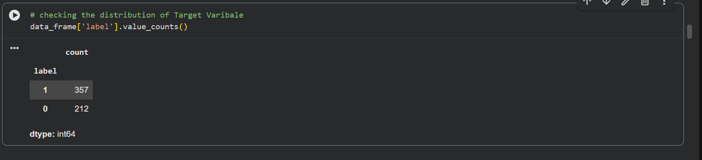
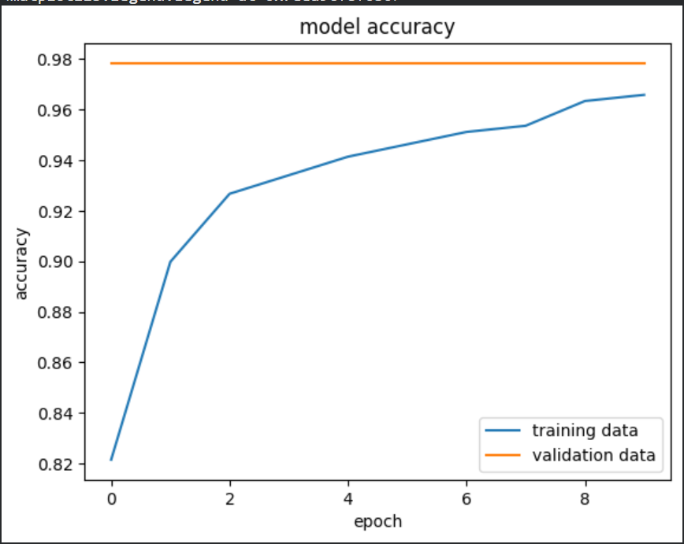
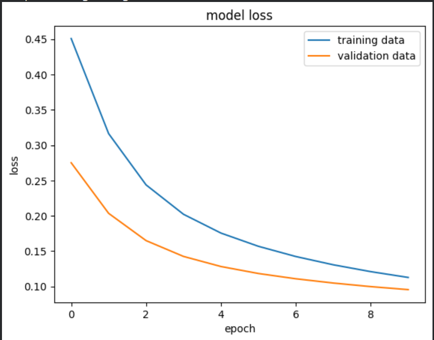
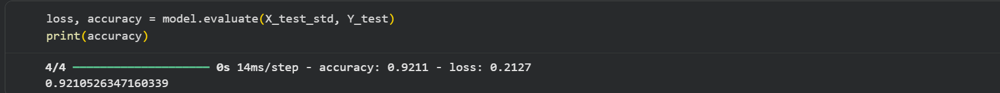

# Breast Cancer Classification using Neural Network

Classifying breast cancer tumors as benign or malignant using an Artificial Neural Network (ANN) — built as part of the AI/ML Internship at Naviotech Solution Pvt. Ltd. (June 2026).

## 📌 Overview

This project uses the Breast Cancer Wisconsin dataset to classify tumors as benign or malignant. A neural network model was trained using TensorFlow/Keras after preprocessing and standardizing the dataset.

## 📊 Dataset

**Source:** Breast Cancer Wisconsin Dataset (scikit-learn)

**Size:** 569 samples, 30 features

**Target:** Diagnosis (Benign / Malignant)

## 🛠️ Approach

- Loaded the Breast Cancer Wisconsin dataset from scikit-learn
- Performed data preprocessing and feature standardization
- Split the dataset into training and testing sets
- Built an Artificial Neural Network (ANN) using TensorFlow/Keras
- Trained the model for multiple epochs
- Evaluated model performance on the test dataset
- Visualized training accuracy and loss

## 📈 Results

| Metric | Score |
|--------|------:|
| Test Accuracy | **92.11%** |
| Test Loss | **0.2127** |

## 📁 Repository Contents

| File | Description |
|------|-------------|
| Breast_Cancer_Classification.py | Python implementation of the project |
| Breast_Cancer_Classification_with_Neural_Network.ipynb | Complete Jupyter Notebook |
| Cancer_Classification_Report.docx | Project report |
| Cancer_Classification.pptx | Project presentation |
| screenshots/ | Output screenshots |

## 🖼️ Screenshots

### Target Variable Distribution

### Model Accuracy

### Model Loss

### Final Test Accuracy

## 🧰 Tech Stack

Python · TensorFlow · Keras · NumPy · Pandas · Matplotlib · scikit-learn

## 🚀 Future Scope

- Improve model performance using hyperparameter tuning
- Compare ANN with other machine learning algorithms
- Deploy the model as a web application
- Test on larger breast cancer datasets

## 👤 Author

Arya Anshuman Panda — B.Tech CSE (Data Science), Gandhi Engineering College, Bhubaneswar  
AI/ML Intern, Naviotech Solution Pvt. Ltd.
